### Configure Spring Security for Spring Boot Project
We will be configuring Spring Security for the Spring Boot project we just created. Let us first understand the Spring Security Architecture.
Understanding Spring Security Architecture
Let us understand how Spring Security Works.
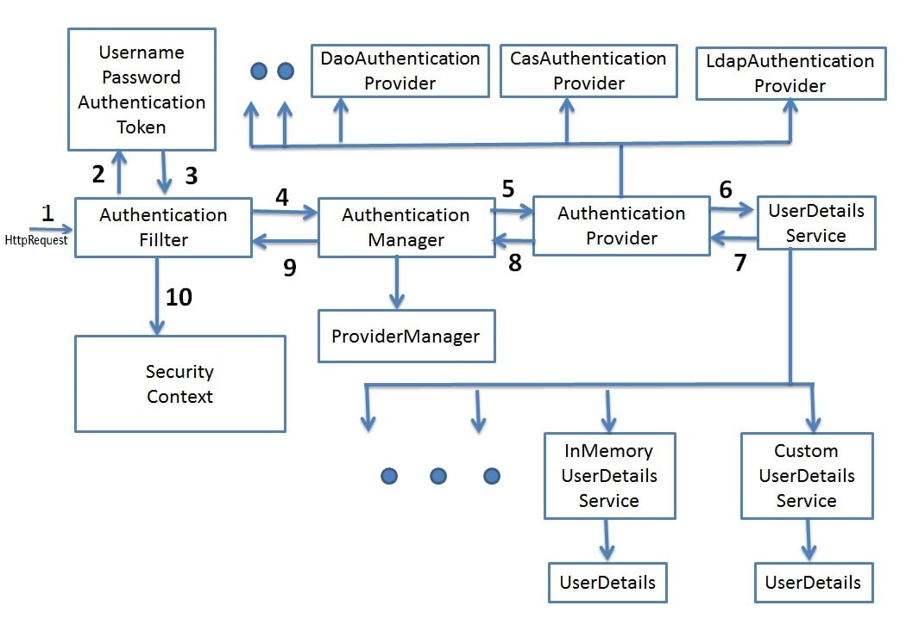
Spring Boot Security Architecture
#### Filters 
- Before the request reaches the Dispatcher Servlet, it is first intercepted by a chain of filters.
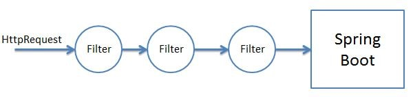
Spring Boot Security Filter Chain

- These filters are responsible for Spring Security. So any incoming request will go through these filters and it is here that authentication and authorization takes place. Based on the type of requests there are different Authentication Filters like the BasicAuthenticationFilter,UsernamePasswordAuthenticationFilter etc
#### Authentication Object Creation 
- When the request is intercepted by the appropriate AuthenticationFilter it retrieves the username and password from the request and creates the Authentication Object. If the extracted credentials are username and password, then UsernamePasswordAuthenticationToken is created.
Spring Boot Security UsernamePasswordAuthenticationToken
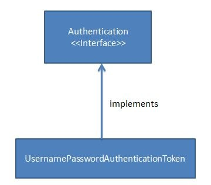
#### AuthenicationManager 
- Using the Authentication Object created the filter will then call the authenticate method of the Authentication Manager. The Authentication Manager is only a interface and actual implementation of the authenticate method is provided by the ProviderManager.
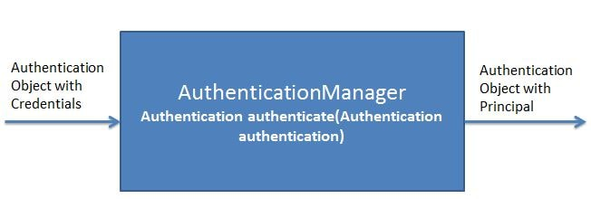
Spring Boot Security Authentication Manager

- Important point to note here is that the Authentication Manager takes an Authentication object as input and after successful authentication again returns an object of type Authentication.
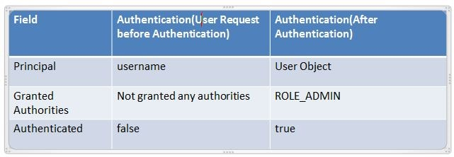
Spring Boot Security Authentication Object
The ProviderManager has a list of AuthenticationProviders. From it's authenticate method it calls the authenticate method of the appropriate AuthenticateProvider. In response it gets the Principal Authentication Object if the authentication is successful.
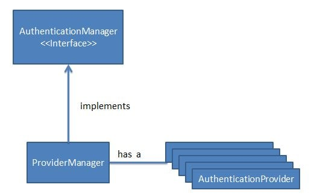
Spring Boot Security Authentication Manager Flow
#### AuthenticationProvider 
- The AuthenicationProvider is an interface with a single authenticate method.
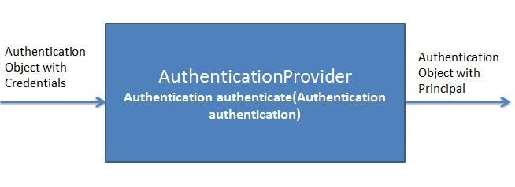
Spring Boot Security Authentication Provider

It has various implementations like CasAuthenticationProvider,DaoAuthenticationProvider. Depending on the implementation an appropriate AuthenicationProvider implementation is used. It is in the AuthenticationProvider Implementation authenticate method where all the actual authentication takes place.
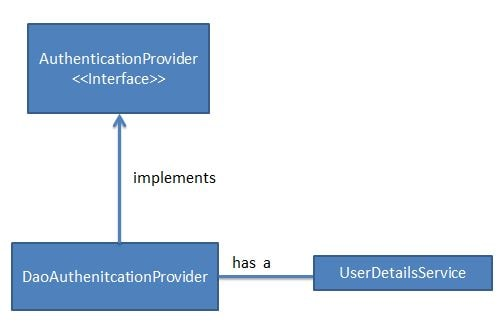
Spring Boot Security Authentication Provider implementation
Using the UserDetails service the AuthenticationProvider fetches the User Object corresponding to the username. It fetches this User Object from either a database, internal memory or other sources. This User object credentials are then compared with the incoming Authentication Object credentials. If Authentication is successful then the Principal Authentication Object is returned in response.
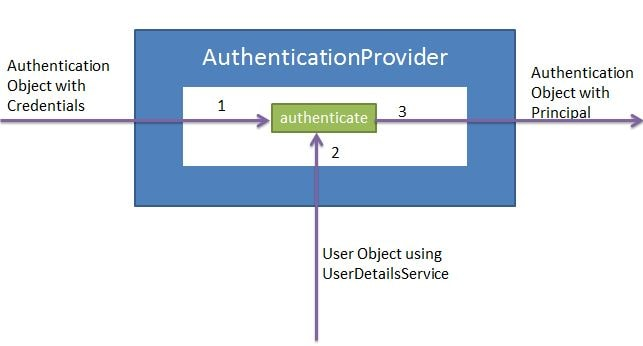
Spring Boot Security Authentication Provider authenticate
#### UserDetailsService 
- The UserDetailsService is an interface having a single method named loadUserByUsername.
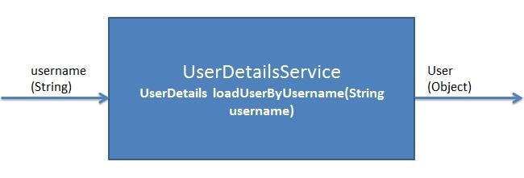
Spring Boot Security User Details Service

It has various implementations CachingUserDetailsService, JDBCDaoImpl etc. Based on the implementation an appropriate UserDetailsService is called.
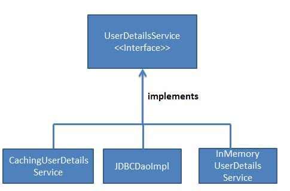
Spring Boot Security User Details Service Implementation
It is responsible for fetching the User Object with username and password against which the incoming User Object will be compared.

Let us have a look Spring Security Autoconfigurations.
When no Spring Security dependency is added -

Spring Boot Security no dependency
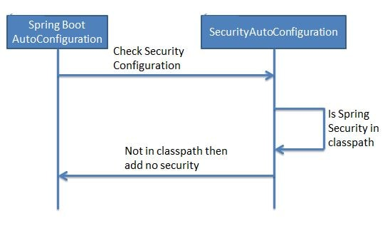

Tested:
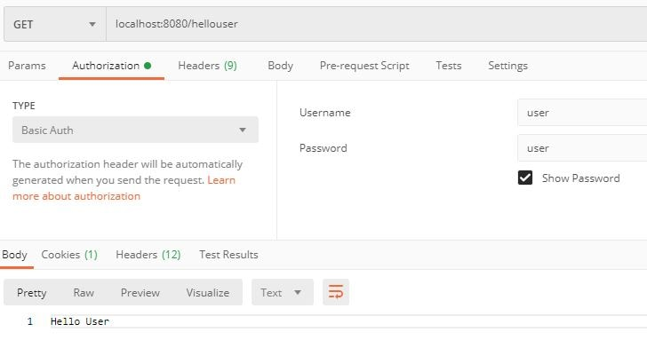
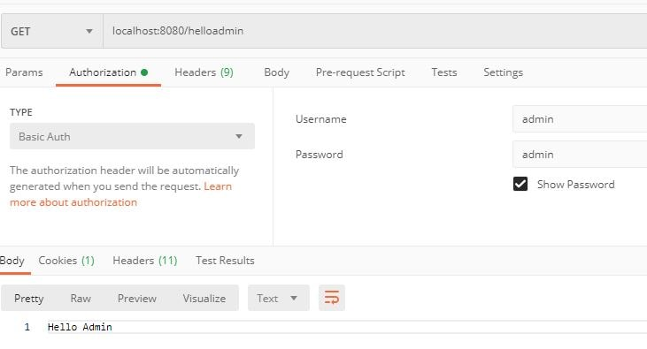
